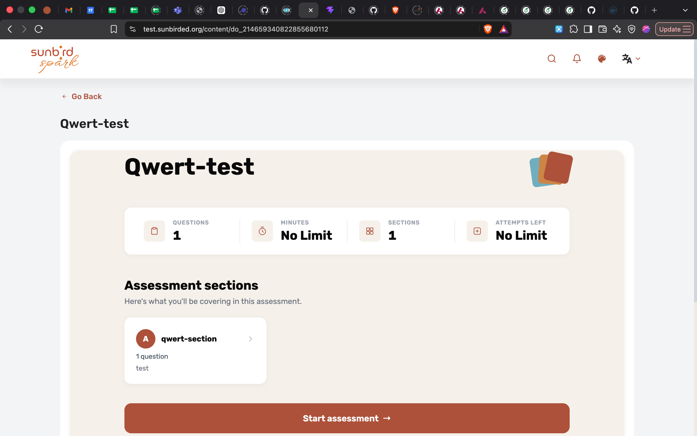
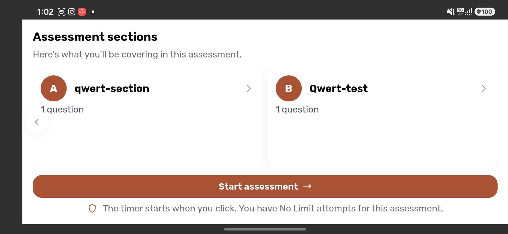
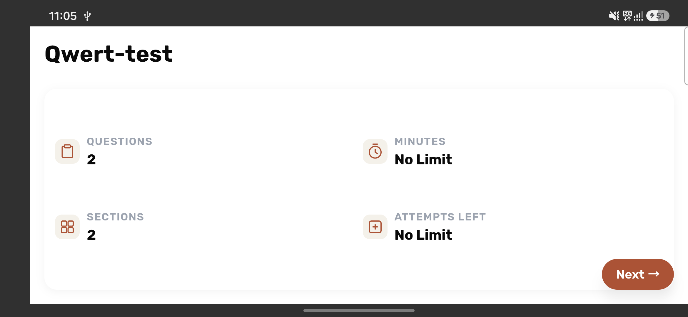
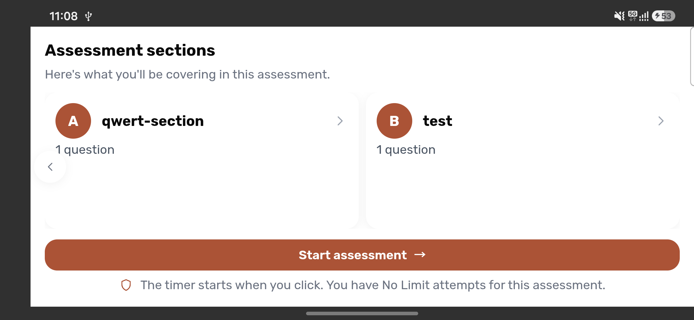

# Root-level questions — before / after

Visual record for the flat & mixed QuestionSet hierarchy support.

Test content ("Qwert-test"): one authored section `qwert-section` (1 question)
plus question(s) placed directly at the questionset root, with no Section
wrapper.

## Before

### Root-level questions were dropped entirely

The unfixed player reports `QUESTIONS 1 / SECTIONS 1` and lists only
`qwert-section`. The root-level question is silently discarded — previously
`extractSectionNodes` filtered out every root child whose `objectType` was
`Question` and only logged a `console.warn`.

### The synthesized group rendered as a mislabelled section card

Once root-level questions were retained, the section synthesized to hold them
was rendered like any other section — and because it inherits the questionset
root's `name`, card **B** reads *"Qwert-test"*: the assessment's own title,
duplicated as one of its own sections.

## After

### Counts include root-level questions

A real section counts as one; a root-level question counts as its own step,
matching how the sidebar and header letter the sequence.

### Each root-level question gets its own correctly-labelled card

Card **B** is now the question's own title (*"test"*), lettered into the same
A/B/C sequence as real sections, and clicking it jumps straight to that
question.

> The counts read `2 / 2` here rather than `3 / 3` because this device is
> pointed at published content, and one further root-level question existed
> only as an unpublished draft — see the `previewMode` change in this PR.
